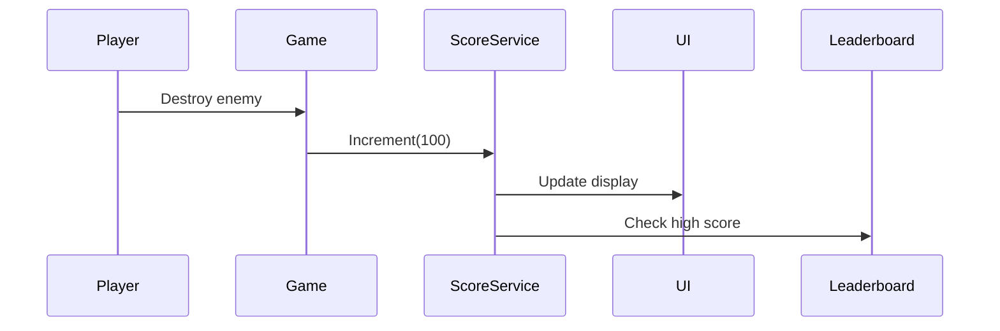

# Space Invaders Game Architecture

## Technical Overview
- **Platform**: Web (HTML5 Canvas + JavaScript)
- **Integration**: Embedded via iframe or Web Component
- **Core Components**:
  1. Game Engine (Canvas-based render loop)
  2. Sprite Management System
  3. Collision Detection System
  4. Score Tracking Module
  5. Leaderboard Service

## Key Architectural Decisions

### 1. Rendering System
- Use HTML5 Canvas for 2D rendering
- Sprite paths:
  - Player: ./sprites/hefeship.png
  - Aliens: ./sprites/alien1.png, ./sprites/alien2.png

### 2. Score System


### 3. Leaderboard Service
- Client-side caching with localStorage
- Cloud-synced via Firebase Realtime Database:
  - Security rules for write protection
  - Anonymous authentication for basic tracking

### 4. Website Integration
```javascript
// Embedding example
<game-container 
   data-api-endpoint="https://api.example.com/leaderboard"
   data-sprite-base="/sprites/">
</game-container>
```

## Next Steps
1. Create core game loop implementation
2. Set up Firebase project configuration
3. Implement website integration wrapper